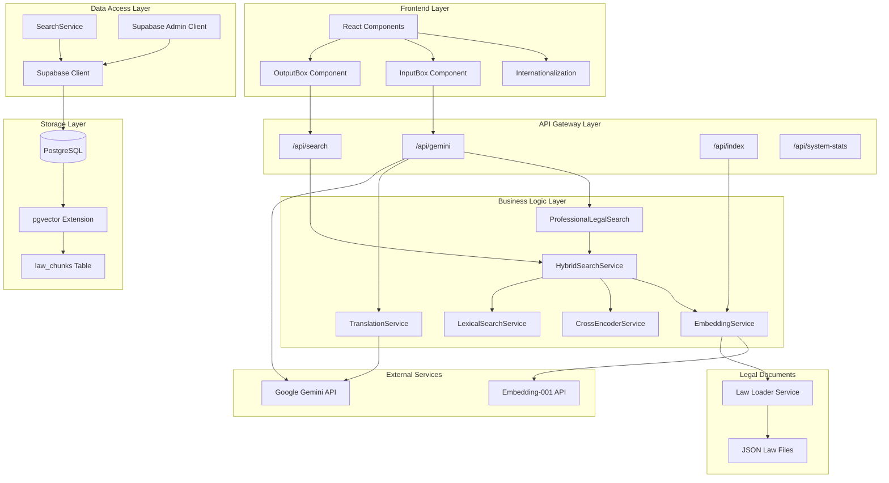
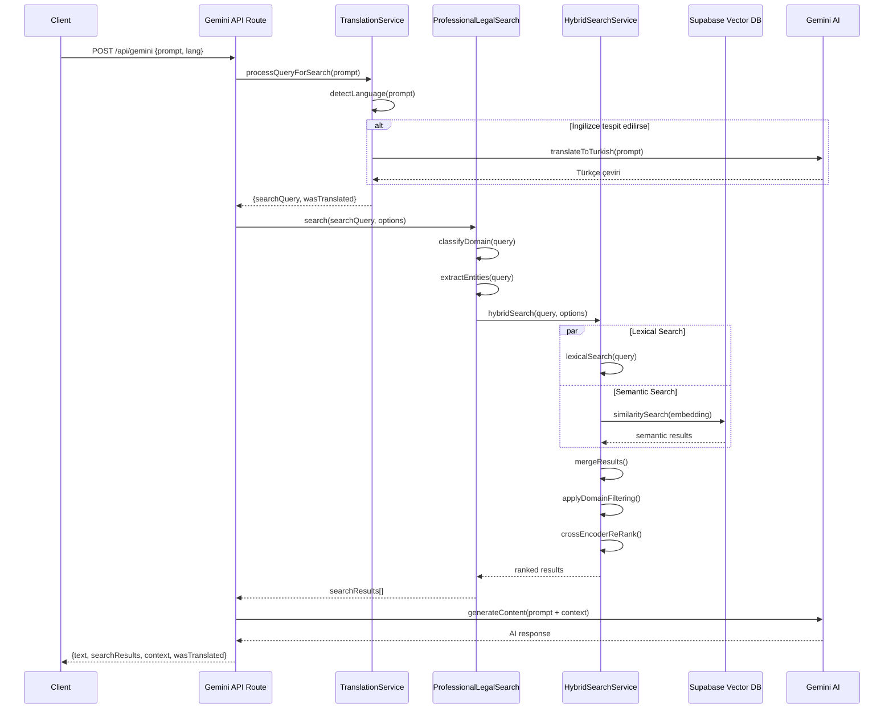
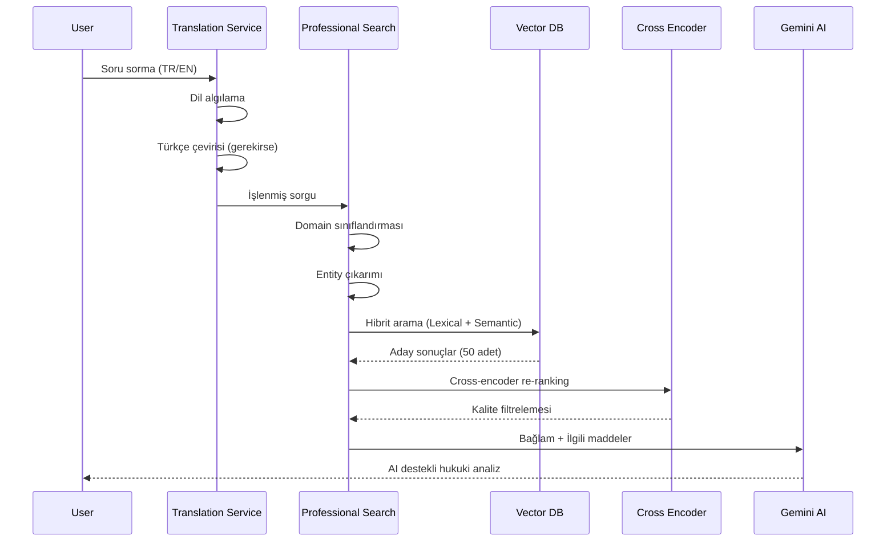

<p  align="center"  style="margin: 30px 0;">

</p>

  

<h1  align="center">LegalMate</h1>
<h3  align="center">Türk Hukuku için Yapay Zeka Destekli Hukuki Bilgilendirme Sistemi</h3>

  

<p  align="center">
<b>Türk mevzuatını RAG (Retrieval-Augmented Generation) ile analiz eden, Google Gemini destekli profesyonel hukuki BİLGİ VE EĞİTİM platformu.</b>
</p>

  

<p  align="center">
<a  href="https://choosealicense.com/licenses/mit/"></a>
<a  href="https://nextjs.org/"></a>
<a  href="https://www.typescriptlang.org/"></a>
<a  href="https://supabase.com/"></a>
<a  href="https://ai.google.dev/"></a>
</p>

  

<p  align="center">
<a  href="https://github.com/elzemeth/LegalMate/stargazers"></a>
<a  href="https://github.com/elzemeth/LegalMate/forks"></a>
<a  href="https://github.com/elzemeth/LegalMate/issues"></a>
<a  href="http://makeapullrequest.com"></a>
</p>

  

<p  align="center">⚠️Yalnızca bilgilendirme amaçlıdır, hukuki görüş yerine geçmez.⚠️</p>

<p  align="center">
<a  href="https://legalmate.vercel.app"  target="_blank">

</a>
<a  href="https://github.com/elzemeth/LegalMate"  target="_blank">

</a>
</p>

  

## İçindekiler

  

<details open>

<summary>Hızlı Erişim Menüsü</summary>

  

- [Amaç](#-amaç)

- [Öne Çıkanlar](#-öne-çıkanlar)

- [Hızlı Bakış](#-hızlı-bakış)

- [Teknoloji Stack](#️-teknoloji-stack)

- [Genel Bakış](#-genel-bakış)

- [Kullanılan Algoritmalar](#-kullanılan-algoritmalar)

- [Dil Desteği](#-dil-desteği)

- [Güvenlik](#️-güvenlik)

- [Kurulum](#-kurulum)

- [Kullanım](#-kullanım)

- [Teknik Mimari](#-teknik-mimari)

  

</details>

  

---

  

<div  align="center">
<h3 id="-amaç">NEYİ AMAÇLADIK?</h3>
</div>

<p  align="center"><b> Vatandaşların kendi haklarını öğrenmesini ve spesifik olaylar için güncel mevzuata dayalı, kanun maddeleriyle birlikte yorum alabilmesini, kendi haklarını öğrenmesini ve hukuki açıdan EĞİTİM/BİLGİ alabilmesini hedefliyoruz. </b></p>

  

## <h3 align="center"  id="-öne-çıkanlar">ÖNE ÇIKANLAR</h3>

  

- **Gelişmiş RAG Tabanlı Arama** (Lexical + Semantic + Cross-Encoder)

- **Türk Hukuk Mevzuatı**na dayalı bilgi sistemi

- **TR/EN Çok Dilli Destek** (Otomatik algılama ve çeviri)

- **RLS + Rate Limiting** ile kurumsal güvenlik

- **Kalite Metrikleri**: Precision@1, Domain Accuracy, FP Reduction

  

## <h3 align="center"  id="-hızlı-bakış"> HIZLI BAKIŞ </h3>

 <p  align="center">
<a  href="https://legalmate.vercel.app"  target="_blank">


</a>
</p>

  

## <h3 align="center"  id="️-teknoloji-stack"> Teknoloji Stack </h3>

  

<p  align="center">

</p>

  

-  **Frontend**: Next.js 15 + TailwindCSS

-  **Backend**: Next.js API Routes (Node.js)

-  **Database**: Supabase PostgreSQL + pgvector

-  **AI**: Google Gemini 2.0 Flash + Embedding-001

-  **Auth & Security**: Supabase RLS + Token Based Access

  
  

## <h3 align="center"  id="-genel-bakış">Genel Bakış</h3>

  

LegalMate, **Türk mevzuatından** alınan yasaları **RAG pipeline** ile işleyip, kullanıcıya **AI destekli hukuki yanıtlar** sunar.

  

**Pipeline Özeti:**

1. Kullanıcı sorgusu alınır (TR/EN)

2. Otomatik dil algılama ve çeviri yapılır

3. Hibrit arama (Lexical + Semantic + Cross-encoder)

4. Cross-encoder ile re-ranking

5. Google Gemini AI ile bağlam tabanlı yanıt oluşturulur

  

---

  

## <h3 align="center"  id="-kullanılan-algoritmalar">Kullanılan Algoritmalar</h3>

  

### Ana Arama Algoritmaları

  

-  **Hibrit Arama (Hybrid Search)**: Lexical + Semantic + Cross-Encoder kombine arama

-  **BM25-like Lexical Search**: Anahtar kelime tabanlı exact matching

-  **Vector Semantic Search**: pgvector ile cosine similarity

-  **Cross-Encoder Re-ranking**: Query-document relevance skorlaması

  

### Yapay Zeka ve NLP

  

-  **Google Gemini 2.0 Flash**: Hukuki analiz ve yanıt üretimi

-  **Embedding-001**: 768-boyutlu vektör embeddings

-  **Language Detection**: Pattern-based + AI-powered dil algılama

-  **Legal Entity Recognition**: Hukuki entity tanıma sistemi

  

### Domain Classification

  

-  **Legal Domain Classifier**: Ceza, Medeni, İş, Gümrük hukuku sınıflandırması

-  **Legal Ontology System**: Hierarchical legal knowledge base

-  **Quality Metrics**: Precision@1, Domain Accuracy, False Positive Reduction

  

---

  

## <h3 align="center"  id="-dil-desteği">Dil Desteği</h3>

  

### Otomatik Dil Algılama

-  **Pattern-based Detection**: Regex patterns ile hızlı algılama

-  **AI-powered Detection**: Gemini AI ile karmaşık metinler

-  **Confidence Scoring**: Algılama güvenilirlik skoru

  

### Gerçek Zamanlı Çeviri

-  **İngilizce → Türkçe**: Hukuki terminoloji korunarak

-  **Bağlam Koruma**: Legal context preservation

-  **Translation Service**: Google Gemini destekli

  

### Desteklenen Diller

-  **🇹🇷 Türkçe**: Ana dil, tüm hukuki metinler

-  **🇬🇧 İngilizce**: Interface ve query desteği

  

---

## <h3 align="center"  id="️-güvenlik">Güvenlik</h3>

  

-  **RLS (Row Level Security)**: Public read + Admin write

-  **Rate Limiting**: IP başına 60 istek/dk


  

## <h3 align="center"  id="-kurulum">Kurulum</h3>

  

```bash

# 1. Repository'yi klonla

git  clone  https://github.com/elzemeth/legalmate.git

cd  legalmate


# 2. Bağımlılıkları yükle

npm  install


# 3. .env.local dosyasını oluştur

cp  .env.example  .env.local


# 4. Development server'ı başlat

npm  run  dev

```

  

`.env.local` örneği:

  

```env

NEXT_PUBLIC_SUPABASE_URL=https://your-project.supabase.co

NEXT_PUBLIC_SUPABASE_ANON_KEY=your-anon-key

SUPABASE_SERVICE_ROLE_KEY=your-service-role-key

GEMINI_API_KEY=your-gemini-api-key

```

  

---

  

## <h3 align="center"  id="-kullanım">Kullanım</h3>

  

### <div align="start">Ana Uygulama</div>

  

1.  `http://localhost:3000` adresine gidin

2. Hukuki sorunuzu detaylı şekilde yazın

3.  **Analiz Et** butonuna tıklayın

4. AI yanıtını ve ilgili kanun maddelerini inceleyin

  

### <div align="start">Yönetim Paneli</div>

  

-  **Sistem İstatistikleri**: İndekslenmiş veri hakkında detaylı bilgi

-  **Veri Yönetimi**: Yeni veri ekleme ve mevcut verileri silme

-  **Sistem Testleri**: Veritabanı bağlantısı ve arama sistemi testleri

---

## <h3 align="center"  id="-teknik-mimari">Teknik Mimari</h3>

<h4  align="center">Architecture Diagram - System Overview</h4>

  



---

<h3  align="center">Sequence Diagram - Search Flow</h3>

  



---

<h3  align="center">RAG Pipeline Akışı</h3>

  


  

---
  

### Bug Reports


Lütfen [GitHub Issues](https://github.com/elzemeth/LegalMate/issues) kullanarak bug rapor edin.


---

<div  align="center">
<p align="center"><strong>LegalMate - Türk Hukuku için Yapay Zeka Destekli Arama Sistemi</strong></p>
<p align="center"><i>Hukuki bilgiye erişimi kolaylaştırıyor, vatandaşları kendi hakları hakkında bilgilendiriyoruz</i></p>
</div>
